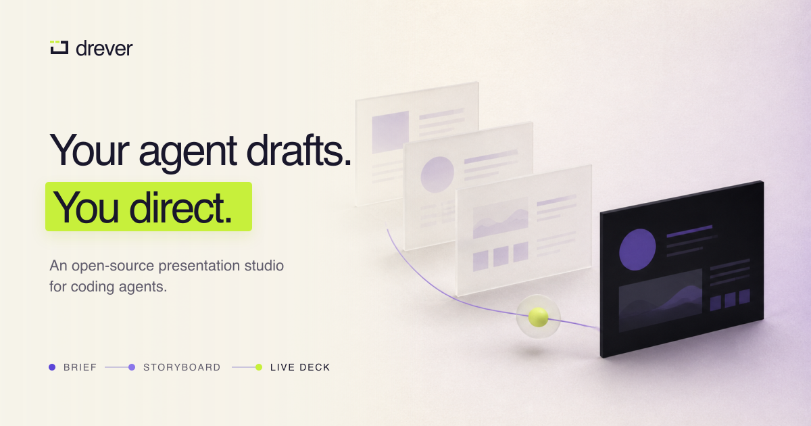

<h1 align="center">
  <a href="https://drever.dev">
    <picture>
      <source
        media="(prefers-color-scheme: dark)"
        srcset="./packages/brand/assets/drever-lockup-dark.svg"
      />
      
    </picture>
  </a>
</h1>

<p align="center">
  <a href="https://drever.dev">
    
  </a>
</p>

<p align="center"><strong>Your agent drafts. You direct.</strong></p>

<p align="center">
  Drever is an open-source, local-first presentation studio for coding agents.
  Approve the story, direct the live draft, and ship a checked React and MDX deck
  from files you own.
</p>

<p align="center">
  <a href="https://drever.dev">Website</a> ·
  <a href="https://drever.dev/docs/">Documentation</a> ·
  <a href="https://drever.dev/showcase/">Showcase</a> ·
  <a href="https://drever.dev/changelog/">Changelog</a> ·
  <a href="./CONTRIBUTING.md">Contributing</a>
</p>

## Start

With your coding agent:

```text
Fetch and follow https://drever.dev/prompt.md
```

Or create a project directly:

```sh
npm create drever@latest my-deck
```

The source stays readable:

```mdx
# One clear idea

---

# Reveal the next decision

<Step>Show the evidence.</Step>
```

<p align="center">
  <sub>Open source under the <a href="./LICENSE">MIT License</a>.</sub>
</p>
